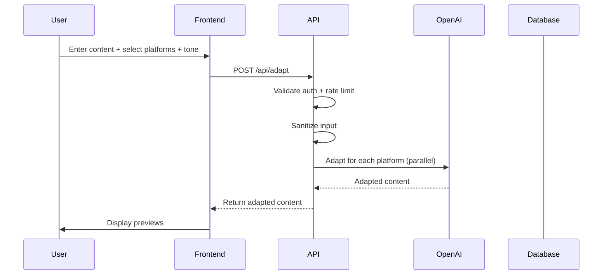
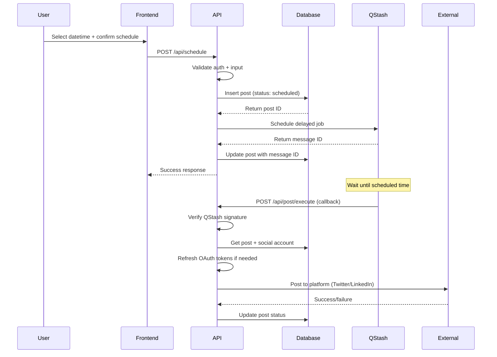
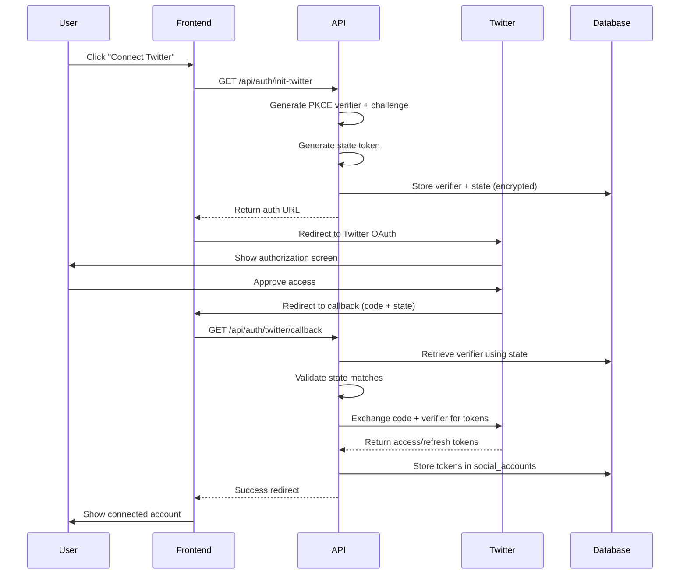

# Repurpose - AI Agent Orchestration & Development Guide

**Version**: 2.0.0
**Last Updated**: October 13, 2025
**Purpose**: Comprehensive guide for Claude Code AI with integrated subagent workflows

---

## Table of Contents

1. [Project Overview](#1-project-overview)
2. [Tech Stack & Architecture](#2-tech-stack--architecture)
3. [Subagent Orchestration System](#3-subagent-orchestration-system)
4. [Core Workflows](#4-core-workflows)
5. [Development Patterns](#5-development-patterns)
6. [Testing & Quality Assurance](#6-testing--quality-assurance)
7. [Deployment & Operations](#7-deployment--operations)
8. [Security & Compliance](#8-security--compliance)
9. [Performance & Optimization](#9-performance--optimization)
10. [Troubleshooting & Debugging](#10-troubleshooting--debugging)

---

## 1. Project Overview

### 1.1 What is Repurpose?

An MVP SaaS platform that enables content creators to:
- Adapt content for multiple social media platforms (Twitter, LinkedIn, Instagram)
- Apply AI-powered humanization and viral content frameworks
- Schedule posts with intelligent timing
- Manage OAuth connections to social platforms
- Track post status and execution

### 1.2 Target Users

- Individual creators and solopreneurs
- Small marketing teams (1-5 accounts)
- Content strategists managing multi-platform presence

### 1.3 Key Differentiators

- **Humanization Protocol**: De-polished, authentic content generation
- **Viral Framework**: 5-axis optimization (Hook, Body, CTA, Intention, Style)
- **Platform-Native Adaptation**: Each platform gets custom guidelines
- **Intelligent Scheduling**: QStash-based delayed execution

---

## 2. Tech Stack & Architecture

### 2.1 Frontend Stack

```yaml
Framework: Next.js 15.5.4 (App Router)
Language: TypeScript 5.x (strict mode)
UI: React 19.1.0
Styling: Tailwind CSS 4 + class-variance-authority
Animations: Framer Motion 12.23.22
Components: shadcn/ui + custom components
Build: Turbopack (Next.js native)
```

### 2.2 Backend Stack

```yaml
Runtime: Node.js (Vercel serverless)
API: Next.js API Routes (app/api/*/route.ts)
Database: Supabase (PostgreSQL + RLS)
Auth: Supabase Auth (email/password + OAuth)
Job Queue: Upstash QStash (delayed execution)
AI: OpenAI GPT-4o (gpt-4o model)
Rate Limiting: Upstash Redis (sliding window)
```

### 2.3 External Integrations

- **OpenAI API**: Content adaptation and humanization
- **Twitter API v2**: OAuth 2.0 PKCE + tweet posting
- **LinkedIn API**: OAuth 2.0 + UGC post publishing
- **Upstash QStash**: Job scheduling and execution
- **Upstash Redis**: Rate limiting and caching
- **Vercel**: Hosting, edge functions, analytics

### 2.4 Architecture Diagram

```
┌─────────────────────────────────────────────────────────────┐
│                    User Browser (React)                      │
│              Next.js 15 App Router + Turbopack               │
└───────────────────────┬─────────────────────────────────────┘
                        │
                        ▼
┌─────────────────────────────────────────────────────────────┐
│                Next.js API Routes (Serverless)               │
│  ┌──────────┬──────────┬──────────┬──────────┬───────────┐ │
│  │  /adapt  │/schedule │  /posts  │  /auth   │/templates │ │
│  └──────────┴──────────┴──────────┴──────────┴───────────┘ │
└───┬──────────┬──────────┬──────────┬──────────┬────────────┘
    │          │          │          │          │
    ▼          ▼          ▼          ▼          ▼
┌────────┐ ┌────────┐ ┌────────┐ ┌────────┐ ┌────────┐
│ OpenAI │ │ QStash │ │Supabase│ │Twitter │ │LinkedIn│
│  GPT-4 │ │        │ │   DB   │ │  API   │ │  API   │
└────────┘ └───┬────┘ └────────┘ └────────┘ └────────┘
               │
               │ (delayed callback)
               ▼
        /api/post/execute
```

---

## 3. Subagent Orchestration System

### 3.1 Orchestration Philosophy

**When to invoke subagents:**
- Complex, multi-step tasks requiring specialized expertise
- Domain-specific implementations (OAuth, security, etc.)
- Tasks that benefit from focused context and expertise
- Parallel execution opportunities (multiple independent tasks)

**When to handle directly:**
- Simple, single-file edits
- Quick bug fixes with clear context
- Documentation updates
- Configuration changes

### 3.2 Available Specialized Subagents

#### 3.2.1 API Security & Authentication Agent
**Specialty**: Authentication, authorization, rate limiting, input validation

**Invoke for:**
- Implementing or fixing auth middleware
- Setting up OAuth flows
- Configuring rate limiting strategies
- Input sanitization and validation
- JWT/session management
- CSRF/XSS protection

**Example invocation:**
```markdown
Task: Implement secure OAuth 2.0 PKCE flow for Twitter authentication with proper state management and token storage.

Requirements:
- Generate cryptographically secure code_verifier and code_challenge
- Store verifier server-side (encrypted session or DB)
- Validate state parameter in callback
- Exchange code for access/refresh tokens
- Store tokens securely in social_accounts table
- Handle token expiration and refresh

Files to review:
- lib/twitter.ts
- app/api/auth/twitter/route.ts
- app/api/auth/twitter/callback/route.ts
```

#### 3.2.2 Content Adaptation & AI Agent
**Specialty**: OpenAI integration, prompt engineering, content optimization

**Invoke for:**
- Modifying content adaptation prompts
- Implementing new AI features
- Optimizing token usage and costs
- Adding tone variations or platform guidelines
- Implementing content caching strategies
- Handling OpenAI API errors and retries

**Example invocation:**
```markdown
Task: Add Instagram Reels support to content adaptation with short-form video script generation.

Requirements:
- Add 'reels' as new platform type
- Create guidelines for 15-60 second video scripts
- Include visual direction, transitions, music suggestions
- Maintain humanization protocol
- Stay within 800 character limit
- Add hook/climax/CTA structure

Files to modify:
- lib/anthropic.ts (add reels guidelines)
- lib/types.ts (extend Platform type)
- app/api/adapt/route.ts (validate reels platform)
```

#### 3.2.3 Database & Schema Architect Agent
**Specialty**: Supabase, RLS policies, migrations, type generation

**Invoke for:**
- Creating or modifying database tables
- Implementing RLS (Row Level Security) policies
- Writing SQL migrations
- Generating TypeScript types from schema
- Optimizing database queries
- Setting up database indexes
- Implementing cascade deletions

**Example invocation:**
```markdown
Task: Add analytics tracking table for post performance metrics with RLS policies.

Requirements:
- Create 'post_analytics' table:
  - id (uuid, primary key)
  - post_id (uuid, foreign key to posts)
  - platform (text)
  - impressions (integer)
  - engagements (integer)
  - clicks (integer)
  - shares (integer)
  - recorded_at (timestamptz)
- RLS policy: users can only view analytics for their own posts
- Index on (user_id, recorded_at) for efficient queries
- Generate TypeScript types

Files to create/modify:
- supabase/migrations/add_post_analytics.sql
- lib/database.types.ts (regenerate)
```

#### 3.2.4 Job Scheduling & Queue Agent
**Specialty**: QStash integration, cron jobs, delayed execution

**Invoke for:**
- Implementing new scheduled job types
- Optimizing job execution strategies
- Handling job failures and retries
- Implementing job cancellation
- Adding recurring job patterns
- QStash signature verification

**Example invocation:**
```markdown
Task: Implement recurring post functionality with weekly/monthly scheduling.

Requirements:
- Add 'recurring_posts' table:
  - frequency (enum: daily, weekly, monthly)
  - next_scheduled_time (timestamptz)
  - is_active (boolean)
- Create cron job to process recurring posts
- Implement copy logic for regenerating posts
- Update QStash scheduling to handle recurring jobs
- Add UI for managing recurring schedules

Files to create/modify:
- app/api/cron/process-recurring-posts/route.ts
- lib/qstash.ts (add recurring job functions)
- lib/types.ts (add RecurringPost type)
```

#### 3.2.5 OAuth Integration Expert Agent
**Specialty**: Twitter/LinkedIn OAuth, token management, PKCE flows

**Invoke for:**
- Adding new OAuth providers
- Fixing OAuth callback issues
- Implementing token refresh logic
- Handling OAuth errors and edge cases
- Managing OAuth scopes and permissions
- Implementing OAuth token encryption

**Example invocation:**
```markdown
Task: Add Instagram OAuth integration with token refresh and post publishing.

Requirements:
- Implement Instagram OAuth 2.0 flow
- Store access/refresh tokens in social_accounts
- Implement token refresh logic (60-day expiration)
- Add post publishing function for Instagram Graph API
- Handle media uploads (photos)
- Implement error handling for rate limits

Files to create:
- lib/instagram.ts (OAuth + posting functions)
- app/api/auth/instagram/route.ts
- app/api/auth/instagram/callback/route.ts
- app/api/post/instagram/route.ts
```

#### 3.2.6 Frontend UX Engineering Agent
**Specialty**: React components, Framer Motion, responsive design

**Invoke for:**
- Building new UI components
- Implementing complex interactions
- Adding animations and transitions
- Responsive design implementation
- Accessibility improvements
- Form validation and error states

**Example invocation:**
```markdown
Task: Create content calendar view with drag-and-drop scheduling.

Requirements:
- Monthly calendar grid component
- Drag-and-drop posts to reschedule
- Visual indicators for scheduled/posted/failed states
- Mobile-responsive (collapse to list view)
- Smooth animations with Framer Motion
- Keyboard navigation support

Files to create:
- components/calendar/CalendarGrid.tsx
- components/calendar/CalendarPost.tsx
- components/calendar/CalendarDay.tsx
- hooks/useCalendarDragDrop.ts
```

#### 3.2.7 Testing & QA Automation Agent
**Specialty**: Playwright E2E, Jest unit tests, integration tests

**Invoke for:**
- Writing comprehensive E2E tests
- Creating unit tests for utilities
- Integration testing API routes
- Setting up test fixtures and mocks
- Implementing test coverage reporting
- CI/CD test automation

**Example invocation:**
```markdown
Task: Create comprehensive E2E test suite for post scheduling flow.

Requirements:
- Test happy path: login → create content → adapt → schedule → verify
- Test error cases: expired token, rate limit, invalid input
- Test edge cases: timezone handling, past dates, concurrent schedules
- Mock external APIs (OpenAI, QStash, Twitter, LinkedIn)
- Set up test database with seed data
- Generate coverage report

Files to create:
- tests/scheduling-flow.spec.ts
- tests/fixtures/users.ts
- tests/fixtures/posts.ts
- tests/mocks/openai.ts
- tests/mocks/qstash.ts
```

#### 3.2.8 Deployment & DevOps Agent
**Specialty**: Vercel config, environment management, CI/CD

**Invoke for:**
- Configuring Vercel deployment settings
- Managing environment variables
- Setting up preview deployments
- Implementing CI/CD pipelines
- Configuring custom domains
- Setting up monitoring and alerts

**Example invocation:**
```markdown
Task: Set up staging environment with separate database and QStash instance.

Requirements:
- Create staging Vercel project
- Set up staging Supabase project
- Configure staging environment variables
- Set up separate QStash queue for staging
- Implement branch-based deployments (develop → staging, main → production)
- Add environment indicator to UI

Files to modify:
- vercel.json (add staging config)
- .github/workflows/deploy-staging.yml
- app/layout.tsx (add environment indicator)
```

### 3.3 Subagent Invocation Patterns

#### Pattern 1: Sequential Dependency
When tasks depend on each other's outputs.

```
Example: Adding a new feature
1. Database Agent: Create schema and migrations
2. API Security Agent: Add auth middleware for new endpoint
3. Content Adaptation Agent: Implement core business logic
4. Frontend UX Agent: Build UI components
5. Testing Agent: Write E2E tests
```

#### Pattern 2: Parallel Execution
When tasks are independent and can run simultaneously.

```
Example: Implementing multiple OAuth providers
- OAuth Expert Agent (Twitter) │ OAuth Expert Agent (LinkedIn) │ OAuth Expert Agent (Instagram)
  ↓ parallel execution          ↓ parallel execution           ↓ parallel execution
  Twitter OAuth complete        LinkedIn OAuth complete         Instagram OAuth complete
```

#### Pattern 3: Iterative Refinement
When a task requires multiple passes for optimization.

```
Example: Performance optimization
1. Deployment Agent: Identify performance bottlenecks
2. Database Agent: Optimize queries and indexes
3. Content Adaptation Agent: Implement caching
4. Testing Agent: Measure improvements
5. (Repeat if needed)
```

### 3.4 Orchestration Decision Matrix

| Task Type | Complexity | Domain Expertise | Recommended Approach |
|-----------|------------|------------------|---------------------|
| Simple bug fix | Low | General | Direct handling |
| OAuth implementation | High | OAuth | Invoke OAuth Expert Agent |
| UI component | Medium | Frontend | Invoke Frontend UX Agent |
| Database migration | High | Database | Invoke Database Architect Agent |
| Multiple OAuth providers | High | OAuth | Invoke multiple OAuth Expert Agents (parallel) |
| New feature (full stack) | High | Multiple | Sequential subagent chain |
| Performance optimization | Medium | Multiple | Iterative refinement pattern |
| Security audit | High | Security | Invoke API Security Agent |

---

## 4. Core Workflows

### 4.1 Content Adaptation Workflow



**Key files:**
- `app/api/adapt/route.ts:12-139` - Main adaptation endpoint
- `lib/anthropic.ts:57-170` - OpenAI integration with viral framework
- `lib/rate-limit.ts` - Rate limiting configuration

**Subagent recommendation:**
- For prompt modifications: Invoke Content Adaptation Agent
- For rate limiting issues: Invoke API Security Agent

### 4.2 Post Scheduling Workflow



**Key files:**
- `app/api/schedule/route.ts:9-198` - Scheduling endpoint
- `app/api/post/execute/route.ts` - QStash callback handler
- `lib/qstash.ts:31-70` - QStash job scheduling
- `lib/social-media/refresh.ts` - Token refresh logic

**Subagent recommendation:**
- For QStash issues: Invoke Job Scheduling Agent
- For OAuth token problems: Invoke OAuth Expert Agent

### 4.3 OAuth Connection Workflow



**Key files:**
- `app/api/auth/init-twitter/route.ts` - OAuth initialization
- `app/api/auth/twitter/callback/route.ts` - OAuth callback handler
- `lib/twitter.ts` - Twitter API helpers
- `lib/linkedin.ts` - LinkedIn API helpers

**Subagent recommendation:**
- For OAuth implementation: Invoke OAuth Expert Agent
- For security concerns: Invoke API Security Agent

---

## 5. Development Patterns

### 5.1 API Route Pattern

```typescript
// Standard API route structure
import { NextRequest, NextResponse } from 'next/server'
import { createClient } from '@/lib/supabase/server'
import { ErrorResponses } from '@/lib/api/errors'
import { checkRateLimit, apiRateLimiter, getRateLimitIdentifier } from '@/lib/rate-limit'

export async function POST(request: NextRequest) {
  try {
    // 1. Authentication
    const supabase = await createClient()
    const { data: { user }, error: authError } = await supabase.auth.getUser()

    if (authError || !user) {
      return ErrorResponses.unauthorized()
    }

    // 2. Rate Limiting
    const identifier = getRateLimitIdentifier(request, user.id)
    const rateLimitResult = await checkRateLimit(apiRateLimiter, identifier)

    if (!rateLimitResult.success) {
      return NextResponse.json(
        {
          error: `Rate limit exceeded. Try again after ${new Date(rateLimitResult.reset).toLocaleTimeString()}.`,
          limit: rateLimitResult.limit,
          remaining: rateLimitResult.remaining,
          reset: rateLimitResult.reset
        },
        { status: 429, headers: rateLimitResult.headers }
      )
    }

    // 3. Parse and validate input
    const body = await request.json()
    const { field1, field2 } = body

    if (!field1) {
      return ErrorResponses.missingField('field1')
    }

    // 4. Business logic
    const result = await processRequest(field1, field2)

    // 5. Success response
    return NextResponse.json({
      success: true,
      data: result
    })
  } catch (error: any) {
    console.error('Error in /api/endpoint:', error)
    return ErrorResponses.internalError(error.message)
  }
}
```

### 5.2 Database Query Pattern

```typescript
// Client-side query (with RLS)
import { supabase } from '@/lib/supabase/client'

const { data, error } = await supabase
  .from('posts')
  .select('*')
  .eq('user_id', userId)  // RLS handles this automatically
  .order('created_at', { ascending: false })

// Server-side query (with admin privileges when needed)
import { getSupabaseAdmin } from '@/lib/supabase'

const supabaseAdmin = getSupabaseAdmin()
const { data, error } = await supabaseAdmin
  .from('posts')
  .update({ status: 'posted' })
  .eq('id', postId)
  .single()
```

### 5.3 Type Safety Pattern

```typescript
// lib/types.ts - Central type definitions
export type Platform = 'twitter' | 'linkedin' | 'instagram'
export type Tone = 'professional' | 'casual' | 'friendly' | 'authoritative' | 'enthusiastic'
export type PostStatus = 'draft' | 'scheduled' | 'posted' | 'failed'

export interface Post {
  id: string
  user_id: string
  platform: Platform
  original_content: string
  adapted_content: string
  scheduled_time: string | null
  status: PostStatus
  posted_at: string | null
  error_message: string | null
  qstash_message_id: string | null
  created_at: string
  updated_at: string
}

export interface SchedulePostJob {
  postId: string
  platform: Platform
  content: string
  userId: string
}
```

### 5.4 Error Handling Pattern

```typescript
// lib/api/errors.ts - Standardized error responses
export enum ErrorCode {
  UNAUTHORIZED = 'UNAUTHORIZED',
  FORBIDDEN = 'FORBIDDEN',
  NOT_FOUND = 'NOT_FOUND',
  INVALID_INPUT = 'INVALID_INPUT',
  RATE_LIMIT_EXCEEDED = 'RATE_LIMIT_EXCEEDED',
  OPENAI_ERROR = 'OPENAI_ERROR',
  QSTASH_ERROR = 'QSTASH_ERROR',
  INTERNAL_ERROR = 'INTERNAL_ERROR'
}

export const ErrorResponses = {
  unauthorized: () => NextResponse.json(
    { error: 'Unauthorized', code: ErrorCode.UNAUTHORIZED },
    { status: 401 }
  ),

  missingField: (field: string) => NextResponse.json(
    { error: `Missing required field: ${field}`, code: ErrorCode.INVALID_INPUT },
    { status: 400 }
  ),

  internalError: (details?: string) => NextResponse.json(
    {
      error: 'Internal server error',
      code: ErrorCode.INTERNAL_ERROR,
      details: process.env.NODE_ENV === 'development' ? details : undefined
    },
    { status: 500 }
  )
}
```

---

## 6. Testing & Quality Assurance

### 6.1 Testing Strategy

```yaml
Unit Tests (Jest):
  - Location: lib/__tests__/
  - Coverage: Utility functions, OAuth helpers, type guards
  - Run: npm test

Integration Tests (Jest):
  - Location: app/api/__tests__/
  - Coverage: API endpoints with mocked external services
  - Run: npm run test:integration

E2E Tests (Playwright):
  - Location: tests/
  - Coverage: Critical user flows (auth, content creation, scheduling)
  - Run: npx playwright test
```

### 6.2 Test Patterns

```typescript
// Unit test example - lib/__tests__/twitter.test.ts
import { generatePKCE } from '../twitter'

describe('Twitter OAuth', () => {
  it('should generate valid PKCE challenge', () => {
    const { verifier, challenge } = generatePKCE()

    expect(verifier).toHaveLength(128)
    expect(challenge).toHaveLength(43)
    expect(challenge).toMatch(/^[A-Za-z0-9_-]+$/)
  })
})

// E2E test example - tests/scheduling-flow.spec.ts
import { test, expect } from '@playwright/test'

test('user can schedule a post', async ({ page }) => {
  // Login
  await page.goto('/login')
  await page.fill('[name=email]', 'test@example.com')
  await page.fill('[name=password]', 'password123')
  await page.click('button[type=submit]')

  // Create content
  await page.goto('/create')
  await page.fill('textarea[name=content]', 'Test content')
  await page.selectOption('select[name=tone]', 'professional')
  await page.check('[value=twitter]')
  await page.click('button:has-text("Adapt")')

  // Wait for adaptation
  await expect(page.locator('.adapted-content')).toBeVisible()

  // Schedule
  await page.fill('input[type=datetime-local]', '2025-12-31T23:59')
  await page.click('button:has-text("Schedule")')

  // Verify success
  await expect(page.locator('.success-message')).toContainText('scheduled')
})
```

**Subagent recommendation:**
- For comprehensive test suites: Invoke Testing & QA Automation Agent

---

## 7. Deployment & Operations

### 7.1 Environment Management

```bash
# Local Development
.env.local                    # Local environment variables (gitignored)
npm run dev                   # Start dev server on localhost:3000

# Staging Environment
Vercel Project: repurpose-staging
Branch: develop → auto-deploy
Database: Supabase staging project
URL: https://repurpose-staging.vercel.app

# Production Environment
Vercel Project: repurpose
Branch: main → auto-deploy
Database: Supabase production project
URL: https://repurpose-orpin.vercel.app
```

### 7.2 Deployment Checklist

**Pre-deployment:**
- [ ] All tests passing (`npm test && npx playwright test`)
- [ ] TypeScript compilation successful (`npm run build`)
- [ ] Lint checks passing (`npm run lint`)
- [ ] Environment variables set in Vercel
- [ ] Database migrations applied
- [ ] OAuth callback URLs updated

**Post-deployment:**
- [ ] Verify health check endpoint
- [ ] Test critical user flows
- [ ] Monitor error rates in Sentry (if configured)
- [ ] Check QStash job execution
- [ ] Verify OAuth flows on production URLs

### 7.3 Vercel Configuration

```json
// vercel.json
{
  "buildCommand": "next build --turbopack",
  "outputDirectory": ".next",
  "framework": "nextjs",
  "regions": ["iad1"],
  "functions": {
    "app/api/**/*.ts": {
      "maxDuration": 30
    },
    "app/api/adapt/route.ts": {
      "maxDuration": 60,
      "memory": 1024
    }
  }
}
```

**Subagent recommendation:**
- For deployment configuration: Invoke Deployment & DevOps Agent

---

## 8. Security & Compliance

### 8.1 Security Checklist

**Authentication & Authorization:**
- [x] All API routes require authentication
- [x] RLS policies enforce user isolation
- [x] JWT/session validation on every request
- [x] User ID verification (no user impersonation)

**Input Validation:**
- [x] Content length limits enforced
- [x] Platform/tone enum validation
- [x] SQL injection prevention (parameterized queries)
- [x] XSS prevention (input sanitization)

**Rate Limiting:**
- [x] AI adaptation: 10 requests/hour per user
- [x] API endpoints: 30 requests/minute per user
- [x] QStash signature verification

**OAuth Security:**
- [x] PKCE implementation for Twitter OAuth
- [x] State parameter validation
- [x] Encrypted token storage
- [x] Token refresh logic with expiration handling

**Secrets Management:**
- [x] Environment variables in Vercel (not in git)
- [x] Separate credentials for staging/production
- [x] Regular key rotation schedule (quarterly)

### 8.2 Known Security Issues (from audit)

| ID | Severity | Issue | Status |
|----|----------|-------|--------|
| CRIT-001 | Critical | `.env` files in git history | ✅ Fixed (keys rotated) |
| CRIT-002 | Critical | `/api/adapt` missing auth | ✅ Fixed |
| CRIT-003 | Critical | Hardcoded PKCE verifier | ✅ Fixed |
| CRIT-004 | High | Token refresh fallback insecure | ✅ Fixed |
| HIGH-001 | High | Missing rate limiting | ✅ Fixed |

**Subagent recommendation:**
- For security audits: Invoke API Security & Authentication Agent

---

## 9. Performance & Optimization

### 9.1 Performance Targets

```yaml
API Response Times (p95):
  /api/adapt: < 5000ms  (OpenAI dependency)
  /api/schedule: < 800ms
  /api/posts: < 300ms
  /api/auth: < 500ms

Page Load Times (p95):
  Landing: < 1500ms
  Dashboard: < 2000ms
  Create: < 1800ms

Database Queries:
  Single record: < 50ms
  List queries: < 100ms
```

### 9.2 Optimization Strategies

**API Optimization:**
- Use `Promise.all` for parallel platform adaptation
- Implement Redis caching for common adaptations
- Lazy load heavy dependencies
- Optimize Supabase queries with indexes

**Frontend Optimization:**
- Next.js Image optimization (automatic)
- Code splitting with dynamic imports
- Lazy load non-critical components
- Implement skeleton loaders for better perceived performance

**Database Optimization:**
```sql
-- Indexes for common queries
CREATE INDEX idx_posts_user_status ON posts(user_id, status);
CREATE INDEX idx_posts_scheduled_time ON posts(scheduled_time) WHERE status = 'scheduled';
CREATE INDEX idx_social_accounts_user_platform ON social_accounts(user_id, platform);
```

---

## 10. Troubleshooting & Debugging

### 10.1 Common Issues & Solutions

#### Issue: OAuth callback fails with "Invalid state"

**Diagnosis:**
```typescript
// Check if state is being stored and retrieved correctly
console.log('Stored state:', storedState)
console.log('Callback state:', callbackState)
console.log('Match:', storedState === callbackState)
```

**Solution:**
- Verify session/cookie storage is working
- Check domain/path settings for cookies
- Ensure state has reasonable expiration (5 minutes)

**Subagent**: Invoke OAuth Expert Agent

---

#### Issue: QStash jobs not executing

**Diagnosis:**
```bash
# Check QStash dashboard
https://console.upstash.com/qstash

# Verify callback URL is accessible
curl -X POST https://your-app.vercel.app/api/post/execute \
  -H "Content-Type: application/json" \
  -d '{"test": true}'
```

**Solution:**
- Verify `NEXT_PUBLIC_APP_URL` is set correctly
- Check QStash signing key verification
- Ensure `/api/post/execute` is not blocked by middleware
- Verify Vercel function timeout is sufficient (30s+)

**Subagent**: Invoke Job Scheduling Agent

---

#### Issue: Rate limit errors in production

**Diagnosis:**
```typescript
// Check Redis connection
const redis = Redis.fromEnv()
const result = await redis.ping()
console.log('Redis connected:', result === 'PONG')

// Check rate limit config
console.log('Rate limiter config:', {
  limit: aiRateLimiter.limiter,
  window: aiRateLimiter.window
})
```

**Solution:**
- Verify Upstash Redis credentials
- Check rate limit windows (10/hour for AI, 30/min for API)
- Implement user feedback with remaining quota
- Consider tiered rate limits for premium users

**Subagent**: Invoke API Security Agent

---

#### Issue: Content adaptation returns empty or malformed responses

**Diagnosis:**
```typescript
// Enable detailed OpenAI logging
console.log('OpenAI request:', {
  model: 'gpt-4o',
  prompt: prompt.substring(0, 200),
  max_tokens: 1024
})

console.log('OpenAI response:', {
  choices: completion.choices.length,
  content: completion.choices[0]?.message?.content?.substring(0, 200)
})
```

**Solution:**
- Verify OpenAI API key is valid and has quota
- Check prompt length (context window limits)
- Adjust `max_tokens` if responses are truncated
- Implement retry logic with exponential backoff
- Add fallback to basic templates if API fails

**Subagent**: Invoke Content Adaptation Agent

---

### 10.2 Debugging Tools

```bash
# Local development debugging
npm run dev  # Start with hot reload

# View build logs
npm run build  # Check for TypeScript errors

# Database debugging
# 1. Go to Supabase dashboard
# 2. Open SQL Editor
# 3. Run diagnostic queries:
SELECT * FROM posts WHERE status = 'failed' ORDER BY created_at DESC LIMIT 10;
SELECT * FROM social_accounts WHERE expires_at < NOW();

# QStash debugging
# Visit: https://console.upstash.com/qstash
# - View scheduled messages
# - Check failed deliveries
# - Review callback logs

# Vercel debugging
# Visit: https://vercel.com/chudi-nnorukams-projects/repurpose
# - View function logs
# - Check deployment status
# - Monitor performance metrics
```

---

## Appendix A: Quick Reference

### Essential Commands

```bash
# Development
npm run dev              # Start dev server (http://localhost:3000)
npm run build            # Build for production
npm run start            # Start production server
npm run lint             # Run ESLint
npm test                 # Run Jest tests
npx playwright test      # Run E2E tests

# Database
supabase link            # Link to Supabase project
supabase db pull         # Pull remote schema
supabase gen types typescript --local > lib/database.types.ts

# Deployment
git push origin main     # Auto-deploy to production
vercel --prod            # Manual production deploy
```

### Important File Locations

```
app/
├── api/                          # API routes
│   ├── adapt/route.ts            # Content adaptation
│   ├── schedule/route.ts         # Post scheduling
│   ├── post/execute/route.ts     # QStash callback
│   └── auth/                     # OAuth flows
├── dashboard/page.tsx            # Main dashboard
├── create/page.tsx               # Content creation
└── layout.tsx                    # Root layout

lib/
├── anthropic.ts                  # OpenAI integration (misnamed)
├── qstash.ts                     # Job scheduling
├── twitter.ts                    # Twitter API
├── linkedin.ts                   # LinkedIn API
├── supabase/                     # Database clients
├── rate-limit.ts                 # Rate limiting
└── types.ts                      # TypeScript types

components/
└── ui/                           # shadcn/ui components
```

### Environment Variables

```bash
# Supabase
NEXT_PUBLIC_SUPABASE_URL=https://xxx.supabase.co
NEXT_PUBLIC_SUPABASE_ANON_KEY=eyJ...
SUPABASE_SERVICE_ROLE_KEY=eyJ...

# OpenAI
OPENAI_API_KEY=sk-proj-...

# Twitter
TWITTER_CLIENT_ID=...
TWITTER_CLIENT_SECRET=...

# LinkedIn
LINKEDIN_CLIENT_ID=...
LINKEDIN_CLIENT_SECRET=...

# QStash
QSTASH_TOKEN=...
QSTASH_CURRENT_SIGNING_KEY=...
QSTASH_NEXT_SIGNING_KEY=...

# App
NEXT_PUBLIC_APP_URL=https://your-app.vercel.app
```

---

## Appendix B: Subagent Decision Tree

```
START: New development task received
│
├─── Is it a simple, single-file edit?
│    ├─── YES → Handle directly
│    └─── NO → Continue
│
├─── Does it involve OAuth or authentication?
│    ├─── YES → Invoke API Security or OAuth Expert Agent
│    └─── NO → Continue
│
├─── Does it involve database schema changes?
│    ├─── YES → Invoke Database Architect Agent
│    └─── NO → Continue
│
├─── Does it involve job scheduling or async tasks?
│    ├─── YES → Invoke Job Scheduling Agent
│    └─── NO → Continue
│
├─── Does it involve AI/content generation?
│    ├─── YES → Invoke Content Adaptation Agent
│    └─── NO → Continue
│
├─── Does it involve UI/UX components?
│    ├─── YES → Invoke Frontend UX Agent
│    └─── NO → Continue
│
├─── Does it involve testing or QA?
│    ├─── YES → Invoke Testing & QA Agent
│    └─── NO → Continue
│
├─── Does it involve deployment or DevOps?
│    ├─── YES → Invoke Deployment & DevOps Agent
│    └─── NO → Continue
│
└─── Complex multi-domain task?
     ├─── YES → Create sequential or parallel subagent chain
     └─── NO → Handle directly with general-purpose approach
```

---

**Document Maintenance:**
- Update version number on major architectural changes
- Review quarterly for accuracy
- Link to SOURCE_OF_TRUTH.md and AGENTS.md
- Keep subagent invocation examples current

**Last Reviewed**: October 13, 2025
**Next Review**: January 13, 2026
